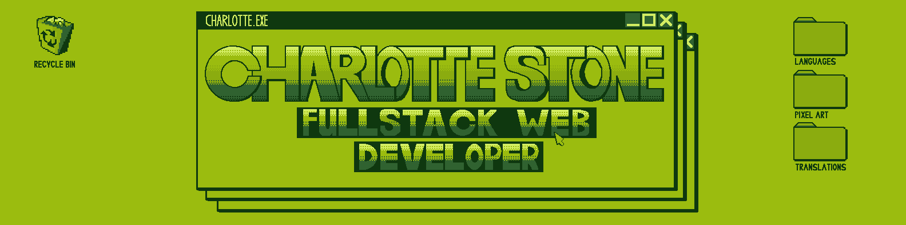

<h2 align="center"> Who Am I </h2>

  - I'm a Full-Stack Developer with an interest/enjoyment of Web Design
  - I'm currently looking to help other developers/engineers in their careers by providing business/tech. English language lessons
  - I feel strongly about sharing and opening doors to education for people all over the world, and I'm currently helping translate free tech education articles from English into Japanese
  - I have 5 years experience as a software engineer in Central London
  - I have 3 years experience as an English Teacher in Yaita-shi, Japan

   <!--  -->

<h2 align="center"> What Are My Interests</h2>

  - Education 🏫
  - Languages 🌐
  - VR 🥽
  - Green technologies 🍃
  - Pixel Art 

   <!--  -->

<h2 align="center">Languages & Technologies I Can Use</h2>

Currently also know (but haven't made icons for):

<ul align="left">
    <li>React</li>
    <li>MongoDB</li>
    <li>Mongoose</li>
    <li>Express</li>
    <li>PhotoShop</li>
    <li>Aseprite</li>
  </ul>

<h2 align="center">Other</h2>

  - How to reach me: Charlie.stone649@gmail.com
  - Pronouns: She/Her
  - I am a poly/hyperglot and speak:
    - English
    - Japanese
    - French
- As well as varying amounts of:
  - Spanish
  - Brazilian Portuguese
  - German

<h2 align="center">My Latest Translations</h2>

<ul>
  <li><a href="https://www.freecodecamp.org/japanese/news/how-to-update-node-and-npm-to-the-latest-version/"><b>Node と NPM を最新バージョンに更新する方法</b></a> <i>Learn how to update node and NPM to the latest version.</i></li>
  <li><a href="https://www.freecodecamp.org/japanese/news/json-stringify-example-how-to-parse-a-json-object-with-javascript/"><b>JSON Stringify の例 - JavaScript で JSON オブジェクトを解析する方法</b></a> <i>Learn how to parse a JSON object with JavaScript</i></li>
  <li><a href="https://www.freecodecamp.org/japanese/news/setting-a-static-ip-in-ubuntu-linux-ip-address-tutorial/"><b>Ubuntu で静的 IP を設定する方法 – Linux IP アドレスチュートリアル</b></a> <i>Set a static IP address on your Linux Ubuntu machine!</i></li>
  <li><a href="https://www.freecodecamp.org/japanese/news/author/charlotte-stone/"><b>More</b></a> <i>Keep Up to date with the articles I translate.</i></li>
</ul>

<h2 align="center">Currently Working On:</h2>
<li>Making a Full-Stack web app called Sekai Experience to further my understanding of full-stack development as well as learn some new tricks</li>
<li>Translating an article on freeCodeCamp for deleting/removing files and directories through the command line on Linux</li>
<li>Starting to work my way through NeetCode so that I can approach software development in a more logical manner with better tools by my side</li>
<li>Creating pixel art icons for phones to sell on Etsy</li>

<h2 align="center">Other</h2>

